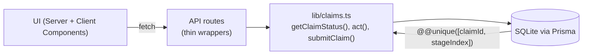
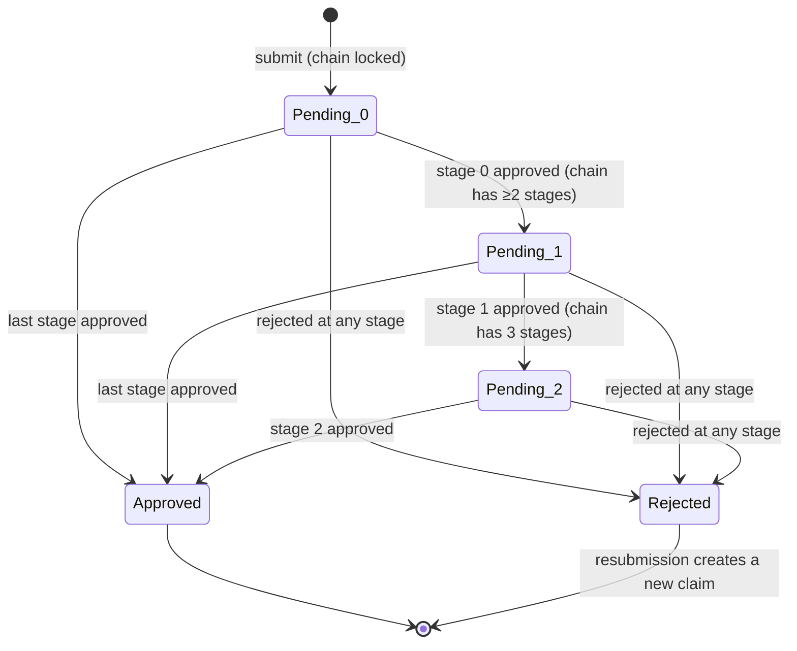
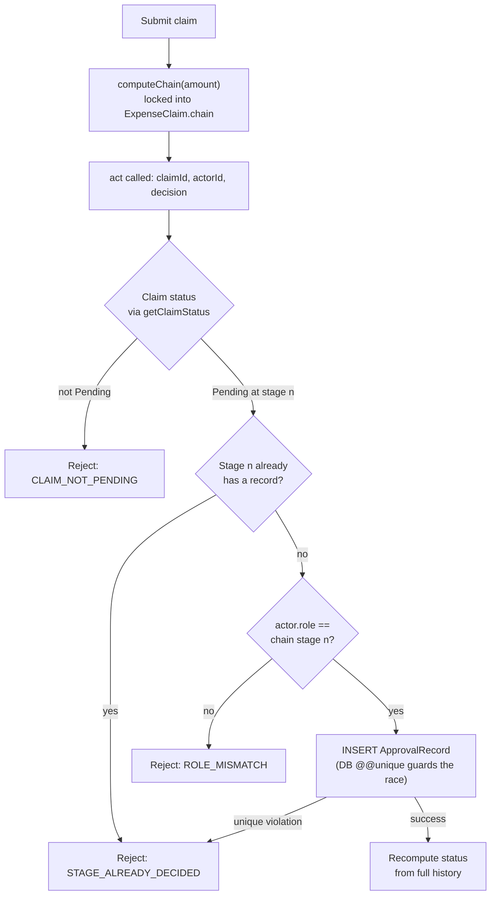

# Expense Claim Approval Workflow — Documentation

## What this is

A multi-stage expense claim approval engine. A claim's approval chain is
determined by its amount and locked in at submission time. The system is
built so it is **structurally impossible** for a claim to reach `Approved`
unless every stage in its chain genuinely approved it, in order, with no
rejection anywhere in its history.

## The invariant

> `status == Approved` **iff** every stage in the claim's chain has an
> `ApprovalRecord` with `decision = approved`, in stage order, **and** no
> `ApprovalRecord` with `decision = rejected` exists anywhere in the claim's
> history.

Every design decision below traces back to protecting this. Status is never
a stored column that application code flips — it's a value derived from the
chain plus the approval history, computed by one function (`getClaimStatus`)
used everywhere it's needed. That removes an entire class of bug: there is
no code path where `status` and the actual approval records can disagree,
because there's no second source of truth for them to disagree with.

## How this was planned

1. Started from the data model and the invariant, not the UI. The Prisma
   schema and its `@@unique([claimId, stageIndex])` constraint were written
   first, before any application code, because the constraint is what makes
   the "two approvers race for the same stage" case safe *at the database
   level* rather than relying on application logic to get a check-then-write
   race exactly right.
2. Wrote `getClaimStatus()` and `act()` as plain functions against Prisma,
   independent of HTTP or UI, and wrote the 7 required test scenarios
   against them directly — before wiring up routes or pages. That way the
   correctness-critical logic was verified before anything else depended on
   it.
3. Only after the logic was tested did API routes and UI get added, as thin
   wrappers that add no business logic of their own.

## Tech stack, and why

- **Next.js (App Router) + TypeScript** — a single project serves both the
  UI and the API routes, which is enough for this scope; no separate
  backend service was justified.
- **Prisma + SQLite** — file-based, zero setup, and its declarative schema
  is what lets the `@@unique` constraint carry real weight. Pinned to
  **Prisma 6.19**, not the newer Prisma 7: v7 replaced the plain
  `datasource { url = env(...) }` config with a driver-adapter model
  (`prisma.config.ts` + an explicit adapter passed to `PrismaClient`),
  which is real added complexity for what the brief calls a "zero setup"
  SQLite project. v6 keeps the standard, well-documented config shape.
- **Vitest** — fast, TypeScript-native, and the tests run against a real
  SQLite test database (via `globalSetup` running `prisma db push`), not a
  mocked Prisma client — the whole point of test 7 is proving the database
  constraint actually holds under a race, which a mock can't demonstrate.
- **Tailwind** — utility classes were enough for a two-page app; no
  component library was worth the dependency at this scope.

## Key technical decisions

**The chain is locked at submission, never recomputed.** If claim policy
changed after submission (thresholds, required roles), recomputing the
chain mid-flight would mean stage indices in existing `ApprovalRecord` rows
could stop matching the "current" chain — silently corrupting the
invariant. Locking `chain` as a JSON snapshot on `ExpenseClaim` at creation
time means a claim's chain is fixed data, not a live derivation, so this
category of bug can't happen.

**Enforcement is role-based, attribution is name-based.** `act()` checks
whether the *selected actor's role* matches the role required at the
*current* stage — not a specific named individual — which mirrors how real
approval chains work (any Manager can approve a Manager-stage claim). But
every `ApprovalRecord` denormalizes the actor's actual `name` and `role` at
decision time, so the audit trail reads as "Approved by Ahmad Zaki
(Manager)" and stays accurate even if that employee's role changes later.

**Rejection is absorbing; resubmission is a new row.** A rejected claim
can't be un-rejected or re-entered at a later stage. Resubmitting creates a
brand-new `ExpenseClaim` with `resubmittedFrom` pointing at the old one —
the old claim and its approval history are never mutated. This keeps every
claim's history append-only and avoids ever having to reason about "what
does approved-then-rejected-then-approved-again mean" for a single row.

**The double-submission guard is two-layered, deliberately.** `act()`
checks in memory whether the current stage already has a decision before
writing (fast, good error messages) — but the actual guarantee against a
race between two concurrent approvals is the database's
`@@unique([claimId, stageIndex])` constraint. If two `act()` calls for the
same stage both pass the in-memory check (a genuine race), the database
rejects the second `INSERT` with a `P2002` error, which `act()` catches and
turns into the same `STAGE_ALREADY_DECIDED` result. Test 7 exercises this
directly with two concurrent calls and asserts exactly one
`ApprovalRecord` exists afterward.

## Architecture overview

- `src/lib/claims.ts` — the only place with business logic: chain
  computation, status derivation, and the guarded `act()` function.
- `src/app/api/**` — route handlers that validate input shape, call into
  `lib/claims.ts`, and map results to HTTP status codes. No logic is
  duplicated here.
- `src/app/page.tsx`, `src/app/claims/[id]/page.tsx` — Server Components
  that read directly from Prisma for the initial render; `SubmitClaimForm`
  and `ActPanel` are Client Components that call the API routes for the
  two mutating actions.

## Flowchart: claim state diagram

`Rejected` is absorbing — there is no transition out of it for the same
claim; the only way forward is a new `ExpenseClaim` row via resubmission.

## Flowchart: submit → act → recompute lifecycle

## Where AI was used, and how it was checked

This project was built with an AI coding agent (Claude Code) working from a
detailed specification (`CLAUDE.md` in this repo) that pins down the
invariant, the data model, the exact check order inside `act()`, and the
required test scenarios up front — the spec was the primary lever for
keeping the agent's output correct, not after-the-fact review alone.

What was delegated to AI: scaffolding the Next.js project, writing the
Prisma schema/migration, the `getClaimStatus`/`act`/`submitClaim`
functions, the API routes, the UI components, and the test suite.

What was verified, not just trusted:
- All 7 required scenarios (plus 7 computeChain tests, including boundary
  values at the RM500/RM2000 thresholds) run against a real SQLite database
  via Vitest — not mocked — specifically because the concurrency test (#7)
  only means something against a real DB constraint.
- The full submit → approve → reject → resubmit path was exercised against
  the actual running dev server and rendered HTML output, not just unit
  tests, to catch integration issues the unit tests wouldn't see (route
  wiring, serialization, page rendering).
- `tsc --noEmit` and `eslint` were run clean before each commit.
- One AI-chosen default was reworked mid-build: the scaffold initially
  installed latest Prisma (v7), which turned out to require the newer
  driver-adapter config model — a meaningful complexity increase for a
  "zero setup SQLite" project. This was caught by running `prisma validate`
  immediately after writing the schema (not assumed to work), and the
  dependency was pinned back to the last Prisma 6 release instead.

## Known limitations (named, not built)

- **No partial approvals.** A stage is a single yes/no from one person;
  there's no support for multiple approvers per stage or majority voting.
- **No delegation.** If the Manager on a claim's chain is unavailable,
  there's no substitute-approver mechanism — any employee with the
  `Manager` role can act, but there's no explicit delegation/OOO feature.
- **No editing an in-flight claim.** Amount or description can't be changed
  after submission; the only path after a rejection is resubmission.
- **No real authentication.** The actor picker is a trusted dropdown, by
  design (see `CLAUDE.md`) — this is explicitly out of scope, not an
  oversight, and would need to be replaced before real users touched this.
- **Before real users touched this**, the first things worth checking:
  concurrent-write behavior under real network latency (the test uses
  `Promise.allSettled` in-process, not genuinely separate clients); and
  whether "any Manager can approve" is actually the desired policy versus
  routing to a specific assigned approver. (Decimal/currency rounding at the
  RM500/RM2000 boundaries was an open risk here but is now covered by
  boundary-value tests at RM499.99/500.01 and RM1999.99/2000.01 in
  `claims.test.ts`.)
